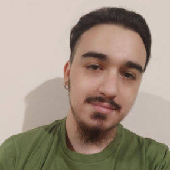

## Bienvenidos a
# Mi presentacion!!

Buenas! mi nombre es **Franco Leonel Anderson Rojas**, alias **Flamarok** , tengo 25 años, y soy estudiante de la carrera de *Tecnicatura en Programación*.

Flamarok? un simple apodo que me hice mediante los videojuegos y como nombre de usuario es facil de recordar.

Comencé a cursar exactamente el año que comenzo la pandemia, tan así que el dia que exponia el tp de CPU se declaró el inicio de la cuarentena.
(./assets/facepalm.jpg)

Desde los 18 años trabajo en los negocios que tenemos con mi familia, algo asi como una cadena de Kioscos, pero proximamente comenzamos con mi hermano la apertura de una inmobiliaria.

El objetivo? Comenzar en el mundo IT, no solo desde el punto de vista laboral, sino tambien ampliando mis contactos y amistades que compartan este mismo interes por la programación y la informática.

También el objetivo es seguir adquiriendo conocimientos. Como por ejemplo un curso de Desarrollo Web que realicé.

### ¿Y cual es el fin de estos objetivos?

Mi sueño es lograr vivir en Irlanda, lugar del que soy un apasionado en muchos aspectos, lograr asentarme, desarrollarme y crecer.

Y que mejor manera de hacer esto que con la profesión que me gusta, tal vez no llegue a ser ni la mitad de bueno que mis compañeros, pero que lo disfruto haciendolo, eso lo puedo asegurar.

## Mis gustos

- Como ya mencioné soy fan de Irlanda, conozco de su música, su historia, algunas costumbres. Por esto mismo practico Fútbol Gaélico, es bastante interesante y muy divertido.

- Me encanta los videojuegos, hace poco me surgió la idea de realizar la Tecnicatura en Programación de VideoJuegos.

- Soy un gran amante de la música, sobre todo el rock clásico, el metal, pero realmente mis gustos musicales son muy amplios.

- Toco la bateria y tengo algo de práctica tocando bajo y guitarra, un hobbie y una herramienta para estar más cerca de la música que uno escucha y de los artistas que uno admira.
